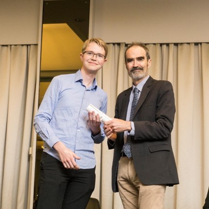

     

     
<b>Email:</b> martin.skilleter@anu.edu.au
<b>Phone:</b> +61 457 579 229

My name is Martin Skilleter and I am an undergraduate student at the Australian National University (preparing to enter my Honours year in 2021). My mathematical interests are quite wide-ranging, though mostly algebraic in nature. For a sample of my work, here are several projects I have completed under the supervision of researchers at the Mathematical Sciences Institute:

- [Inner Product Spaces in Lean](./Inner Product Spaces in Lean.pdf)
- [Applications of Persistent Homology](./Applications of Persistent Homology.pdf)
- [K-Theory of C*-Algebras](./K-Theory of C-star Algebras.pdf)
- [Invariants of Finite Groups](./Invariants of Finite Groups.pdf)

